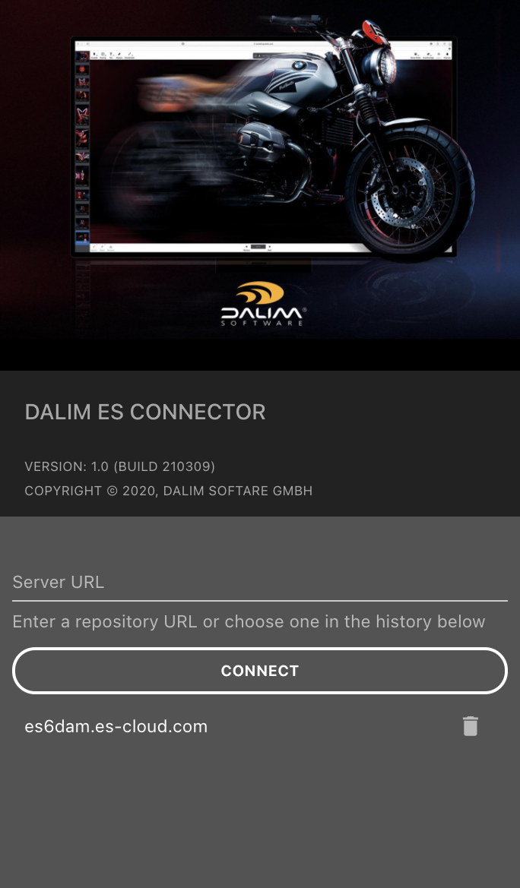
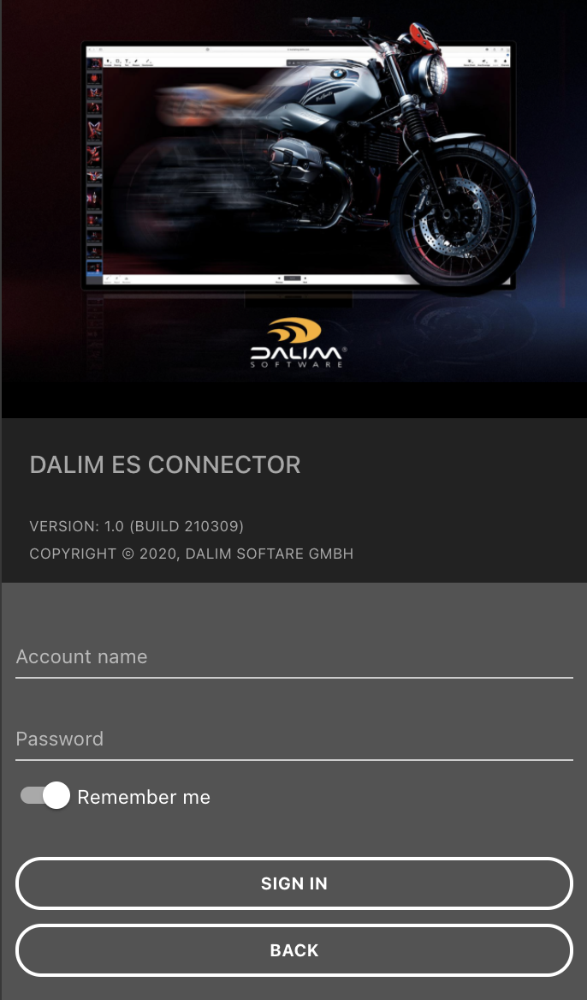
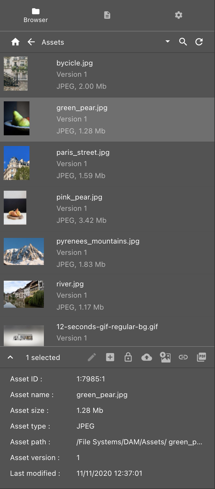
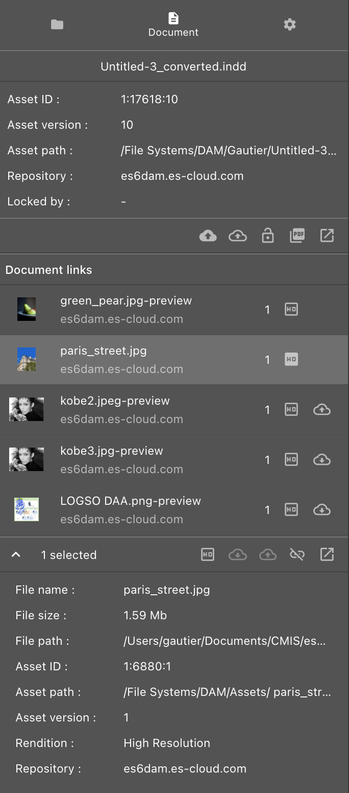
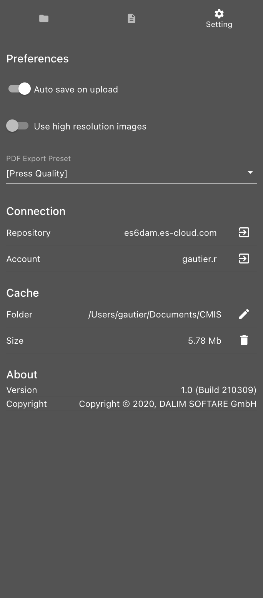

# ES Connector

*Author: Gautier Ringeisen*
<br>
*Version: 1.0*

The ES Connector is an Adobe Creative Cloud extension that allows you to connect and browse an ES server, place asset from that server in your Adobe documents and upload your creations on the repository directly from the Adobe applications.

# Getting started

## Install from Adobe Exchange

Comming soon...

## Manual installation

**Step 1** - Unzip the archive `ESConnector_install.zip`

**Step 2** - Run the installer for your plateform

* Mac OS:	`install_mac`
* Windows:	`install_win.bah`

## User interface

Open either your `Adobe InDesign`, `Adobe Illustrator` or `Adobe Photoshop`, open the menu `Window > Extensions > DALIM ES CONNECTOR`, the ESConnector will then appear in the side panel.

### Connexion GUI

| Index page | Login page |
| ---------- | ---------- |
|  |  |  

### Index page

If you open the ESConnector for the first time, you'll land on the index page.

Here you can enter the the ES server name you want to connect. The Server URL either a hostname, a hostname with a port number or a URL.
```
es6dam.es-cloud.com
es6dam.es-cloud.com:443
https://es6dam.es-cloud.com
```
Below the `Connect` button, you will retreive all the servers you've previoulsly connected. By selecting on one of them, the ESConnector will attempt to connect immediately to the server.

### Login page  

Once connected to the server, you'll be invited to sign in by entering your credentials.
If the ES server you choose is delegating the authentication to a SSO server, the login page of the identity provider will be displayed instead.

### ESConnector GUI

| Browser tab | Document tab | Settings tab |
| ----------- | ------------ | ------------ |
|  |  |  |

### Browser tab

The `Browser` tab allows you to navigate in the repository. You can place assets in your document from this view.

#### Navigation bar

|   | Action | Description |
| - | ------ | ----------- |
|        | **Home**    | Go to the root folder of the repository |
|  | **Back**    | Go to the parent folder |
|      | **Search**  | Enable the search mode |
|       | **Clear search**  | Exit the search mode |
|     | **Refresh** | Refresh the content of the current folder |

The navigation will always display the name of the current folder in the middle. When clicked, this text will expand as a breadcrumb allowing you to go back to any parent folder from your location. When the search mode is active, this breadcrumb will turn into a search field.

#### Action bar

|   | Action | Description |
| - | ------ | ----------- |
|          | **Edit**       | Checkout the selected document and start editing it |
|         | **Place**      | Place the selected asset(s) in the active document |
|             | **Lock**       | Lock the selected document on the repository |
|        | **Unlock**     | Unlock the selected document on the repository |
|          | **Upload**     | Upload the active document on the repository |
|            | **Link all**   | Link all non-http asset(s) with the one(s) on the server having the same name |
|  | **Export PDF** | Export the active document as PDF and upload it on the server |


### Document tab  

The `Document` tab displays information about the active document and the linked assets it contains.  

#### Document action bar

|   | Action | Description |
| - | ------ | ----------- |
|          | **Upload**     | Upload the active document on the repository |
|           | **Check in**   | Check the active document in. The document will be automatically unlocked. |
|             | **Lock**       | Lock the active document on the repository |
|        | **Unlock**     | Unlock the active document on the repository |
|  | **Export PDF** | Export the active document as PDF and upload it on the server |
|          | **Go to**      | Open the Browser tab on the active document | 

#### Asset action bar

|   | Action | Description |
| - | ------ | ----------- |
|             | **Set highres** | Replace the selected asset with its High resolution rendition |
|              | **Set lowres**  | Replace the selected asset with its Low resolution rendition |
|  | **Download**    | Download the selected asset |
|          | **Check in**    | Check the selected asset in |
|         | **Upload**      | Upload the selected asset. The asset will be upload in the server based on the location in the browser tab |
|       | **Unlink**      | Unlink the selected asset from the server | 
|         | **Go to**       | Open the Browser tab on the selected asset |


### Settings tab

The `Settings` tab allows you to set your preferences and manage the connection. You can also change the account and the connected repository in this interface.

|   | Action | Description |
| - | ------ | ----------- |
|  | **Change repository**   | Leave the current repository and go back to the index page of the connector |
|       | **Sign out**            | Sign out from the current repository and go back to the login page |
|       | **Change cache folder** | Change the location of the cache folder | 
|       | **Clear cache**         | Clear the cache of the ES Connector |


## Under the hood

The ESConnector uses only standard functions of the host application to edit the document and its asset links. When hosted in an Adobe Creative Cloud applications, the ES Connnector will communicate with the application using the [CEP extension framework](https://github.com/Adobe-CEP/CEP-Resources)  and will performs all the Document and Asset links operations in [ExtendScript](https://www.adobe.com/devnet/scripting.html). 

When an Asset coming from the repository is placed in the Document, a set of metadata will be associated to it in order to be able to keep trace of its origin, remote location, version, etc. <br>Depending on the host application, these metadata will be store in a InDesign Label or in an Illustrastor Tag. In both cases, it will be stored as a stringified JSON object and can be extracted as such.

The metadata JSON object has the following properties:
```js
{
	assetId: String,     // The unique ID of the asset withing the repository 
	assetPath: String,   // The virtual path of the asset within the repository
	assetUrl: String,    // An URL pointing to the asset on the repository
	contentId: String,   // The ID of the asset rendition placed in the document  
	rendition: String,   // The current rendition name of the asset as it appear in the document
	repository: String,  // The name of the repository the asset comes from
	version: String      // The version of the asset placed in the document
}
```

These metadata can be extracted from the document as shown below. The method to extract the metadata will differ between InDesign and Illustrator.
As the metadata are store as a stringified JSON, you will have to decode the value using a JSON library. The JSON encoding/decoding library `json.jsx` is provided with the ES Connector, you can find it in `src/lib/esconnector-1.0.0/`

In `Adobe InDesign`, you have to extract a label named `metadata`
```js
//@include "./json.jsx"

var metadata = JSON.parse( app.activeDocument.links[0].extractLabel("metadata") );
$.writeln(metadata.assetPath);

// Output: /File System/DAM/Assets/pears.png
```

In `Adobe Illustrator`, you have to extract a Tag named `metadata`
```js
//@include "./json.jsx"

var metadata = JSON.parse( app.activeDocument.placedItems[0].tags.getByName(name).value );
$.writeln(metadata.assetPath);

// Output: /File System/DAM/Assets/pears.png
```

## The Developer's Corner

### How to setup an ES Connector development environment 

To build and deploy the ESConnector locally for development purpose, follow these steps **(MacOS only)**.

**Step 1** - Unzip the archive `ESConnector_projet.tgz` or clone the repository, then go in the project folder.
```
$ unzip ESConnector_project.zip -d ./ESConnector
$ cd ./ESConnector
```

**Step 2** - Copy the `src` or `build/output` folder as `ESConnector` in the Adobe CEP folder.

Link the project `src` folder in the Adobe CEP extension folder.
```
$ ln -s ./src "/Library/Application Support/Adobe/CEP/extensions/ESConnector"
```

**Step 3** - Enable the debug mode to run non signed extension. Depending on the version of Adobe CC you have, the command might differ.

For `Adobe CC 2019` and `2020`
```
$ defaults write ~/Library/Preferences/com.adobe.CSXS.9.plist PlayerDebugMode 1
```

For `Adobe CC 2021`
```
$ defaults write ~/Library/Preferences/com.adobe.CSXS.10.plist PlayerDebugMode 1
```

**Step 4** - Open either your `Adobe InDesign`, `Adobe Illustrator` or `Adobe Photoshop` and then open menu `Window > Extensions > DALIM ES CONNECTOR`

From now on, all the changes you will do in the `src` folder will automatically apply to the ES Connector running in the host application.

### ES Connector Project folder structure

| File or folder                  |   |
| ------------------------------- | - |
| `/doc/**`                       | The ES Connector documentation  |
| `/src/CSXS/manifest.xml`        | The CEP extension manifest file |
| `/src/WEB-INF/web.xml`          | A web.xml file for J2EE container compliance |
| `/src/gui/init.jsx`             | The ES Connector initialization script |
| `/src/gui/index.jsx`            | The index and login page GUI |
| `/src/gui/application.jsx`      | The main application GUI |
| `/src/gui/hooks.jsx`            | Some custom React Hooks |
| `/src/gui/icons.jsx`            | The definition of all the GUI icons |
| `/src/gui/locale.jsx`           | The translations for the GUI in all languages |
| `/src/gui/theme.jsx`            | The GUI theme builder |
| `/src/gui/*.png`                | GUI images |
| `/src/lib/babel-6.26.0/*`       | The babel library used to compile the interface in development mode and during the compilation. |
| `/src/gui/esconnector-1.0.0/csinterface.js`             | The Adobe CSInterface library to communicate with Adobe products from the extension. |
| `/src/gui/esconnector-1.0.0/esconnector.development.js` | The ESConnector controller |
| `/src/gui/esconnector-1.0.0/host.jsx`                   | The ExtendScript libray used by the ES Connector to manipulate the documents |
| `/src/gui/esconnector-1.0.0/json.jsx`                   | An ExtendScript implementation of a JSON encoder/decoder |
| `/src/gui/material-ui-4.9.12/*` | The Material UI library |
| `/src/gui/react-16.13/*`        | The React JS framework  |
| `/src/.debug`                   | The .debug file to enabled the CEP extension debug mode |
| `/src/esconnector.xml`          | The Office AddIn description file |
| `/src/index.html`               | The index html page for the developement environement |
| `/src/index.production.html`    | The index html page for the production environement |
| `/src/logout.html`              | The logout page called when the user logs out the connector |
| `/build.sh`                     | The build script |
| `/install_mac`                  | The Mac OS install script |
| `/install_win.bat`              | The Windows install script |

### How to debug the ES Connector 

To debug the ES Connector we recommand to use the application [CEF Client](https://github.com/Adobe-CEP/CEP-Resources/tree/master/CEP_10.x/Cefclient_v74). Since Adobe Creative Cloud 2021 you can also debug CEP extensions using a regular Chrome web browser.

Only the development version of the ES Connector has the debug mode actived. To connect a debugger to the extension, just start the [CEF Client](https://github.com/Adobe-CEP/CEP-Resources/tree/master/CEP_10.x/Cefclient_v74) and open one of the URL below in it (each application opens a different debug port).

| Application | Port | Debug URL             |
| ----------- | ---- | --------------------- |
| Photoshop   | 8087 | http://127.0.0.1:8087 |
| InDesign    | 8088 | http://127.0.0.1:8088 |
| Illustrator | 8089 | http://127.0.0.1:8089 |

For more details about debugging a CEP extensions, please refer to the [Remote debugging](https://github.com/Adobe-CEP/CEP-Resources/blob/master/CEP_10.x/Documentation/CEP%2010.0%20HTML%20Extension%20Cookbook.md#remote-debugging) section of the CEP documentation.

### How to build the ES Connector 

To build the ES Connector you simply have to execute the `build.sh` script sitting at the root of the project.
```sh
$ ./build.sh
```
As a result of the build process, the script will produce 3 ZIP archives in the `build` folder: 

| ZIP Archive                      | Content                   |
| -------------------------------- | ------------------------- |
| `./build/ESConnector_dev.zip`    | A development version of the ES Connector that can be distributed and installed for testing purpose. It has the debug mode activated. This archive is basically just a ZIP of the `src` folder. |
| `./build/ESConnector_prd.zip`    | A production version of the ES Connector that can be distributed and published on Adobe Exchange. All the sources are converted to ECMAScriptn 5 and compressed. The debug mode is not activated. |
| `./build/ESConnector_install.zip` | This archive contains the production version of the ES Connector along with an installer for Mac OS and Windows. The prupose of the archive is to be able to distribute the ES Connector out of the Adobe Exchange plateform |

### How to deploy the ES Connector 

The ES Connector provides its own interface, therefore it can be deployed as a standalone CEP extension by using the `ESConnector_install.zip` archive. However, we recommand to publish the ES Connector through the Adobe Exchange plateform so anyone can get it easily. You can take a look at this [Getting started](https://helpx.adobe.com/exchange/help/getting-started-developer.html) page to know how to publish extensions on Adobe Exchange.

A DALIM ES server can also provides its own custom version of the ES Connector. To do that, you have to expose the content of one of the 2 archive `ESConnector_dev.zip` or `ESConnector_prd.zip` under the URL `/ESConnector` on the same origin than the ES server itself.
For instance if your ES server is accessible at `https://www.es-cloud.com/Esprit` you have to expose your custom ES Connector as `https://www.es-cloud.com/ESConnector`. Then, when a ES Connector will connects that DALIM ES repository, it will automatically use the exposed ES Connector instead of the built-in interface.

Note that the 2 archive `ESConnector_dev.zip` or `ESConnector_prd.zip` can also be deployed on a J2EE container like Tomcat. You simply have to copy one of them as `ESConnector.war` in the `webapp` folder.

### How to integrate the ESConnector controller in your own GUI

The only library you need have the ESConnector controller in your GUI is the `esconnector-1.0.0`. You will have to expose the complete folder on you webserver and add the `esconnector.production.js` in your HTML interface.

Then call the function `cef.init` to wait for the ES Connector to initialize.

```html
<html>
	<head>
		<script type="text/javascript" src="./esconnector-1.0.0/esconnector.production.js"></script>
		<script>
			cef.controller.init(function() {
				
				console.log(cef.controller.getActiveDocument().name);

			});
		<script>
	</head>
	<body>
		<!-- ... -->
	</body>
</html>
```

### ESConnector Controller

All the functions you need to manipulate the document in the host application and communicate with th repository are avaiable in the Javascript object `cef.controller`.

#### init

```js
cef.controller.init(
	options?: {
		repositoryType: String,     // Default to ES (This option is useless for now)
		repositoryBaseUrl: String   // default to window.location, can be changed to an other ES server.
	},
	callback: Function(err: Object, success: Boolean)
);
```

Initialize the ESConnector.
If you want the ESConnector to automactially connect a specific repository, provide its base URL in the options.

#### getActiveDocument
```js
cef.controller.getActiveDocument(): Document
```

Returns a `Document` object describing the active document displayed in the host application

#### getActiveDocumentLink
```js 
cef.controller.getActiveDocumentLink(
	linkId: String
): Link
```

Returns a `Link` object from a given link Id or `null` if no link match.

#### getRepositoryName
```js
cef.controller.getRepositoryName(): String
```

Returns the current repository name or `null` if the connector is not yet connected to any repository (e.g. on the server selection page)

#### getAccountName
```js 
cef.controller.getAccountName(): String
```

Returns the account name of the current user or `null` if the connector is not yet authenticated.

#### getIndexURL
```js
cef.controller.getIndexURL(): String
```

Returns the URL of the index page of the Connector. This function is useful to redirect the user to the server selection page.

#### isSupportedDocumentType
```js
cef.controller.isSupportedDocumentType(
	type: String
): Boolean
```

Returns whether or not the provided mimetype is a supported document format for the host application. We consider as a supported document type, the kind of file the host application is able to open and save.

#### isSupportedLinkType<br>isSupportedAssetType

```js
cef.controller.isSupportedAssetType(
	type: String
): Boolean
```

Returns whether or not the provided mimetype is a supported asset format for the host application. We consider as a supported asset, the kind of files that can be placed inside or linked to a document.

#### getAsset
```js
cef.controller.getAsset(
	assetId: String, 
	callback: function(err: Object, asset: Asset)
)
```

Retreives the asset properties from a given `assetId`.

#### listAssets
```js
cef.controller.listAssets(
	assetId: String, 
	callback: function(err: Object, assetList: Asset[])
)
```

Retreives all the assets in a container (folder) from a given `assetId`. If the `assetId` is the one of a document, the function will retreive all the revisions of the document.

#### searchAssets
```js
cef.controller.searchAssets(
	query: String, 
	callback: function(err: Object, assetList: Asset[])
)
```

Retreives all the assets matching the search `query`.

#### checkAssetOut
```js
cef.controller.checkAssetOut(
	assetId: String, 
	callback: Function(err: Object, success: Boolean)
)
```

Check the asset out by locking it server side.

#### cancelAssetCheckOut
```js
cef.controller.cancelAssetCheckOut(
	assetId: String, 
	callback: Function(err: Object, success: Boolean)
)
```

Cancel the asset checkout status and unlock it server side.

#### checkAssetIn
```js
cef.controller.checkAssetIn(
	assetId: String, 
	data?: ArrayBuffer | Blob | File | String,
	callback: Function(err: Object, asset: Asset
)
```

Check the asset `assetId` in and optionally uploads a new version of it. The asset will be unlocked.

#### lockAsset
```js
cef.controller.lockAsset(
	assetId: String, 
	callback: Function(err: Object, success: Boolean)
)
```

Locks the asset in the repository. This function is an alias of `checkAssetOut`.

#### unlockAsset
```js
cef.controller.unlockAsset(
	assetId: String, 
	callback: Function(err: Object, success: Boolean)
)
```

Unlocks the asset in the repository. This function is an alias of `cancelAssetCheckOut`.

#### newDocument
```js
cef.controller.newDocument(
	callback: Function(err: Object, document: Document)
)
```

Create a new document in the host application

#### getPDFExportPresets
```js
cef.controller.getPDFExportPresets(
	callback: Function(err: Object, presets: String[])
)
```

Retrieves the list of available PDF presets in the host application.

*(Adobe Suite Only)*

#### updateDocumentMetadata
```js
cef.controller.updateDocumentMetadata(
	callback: Function()
)
```

Force the ESConnector to update from the repository the metadata of the active document and its links.

#### downloadDocument
```js
cef.controller.downloadDocument(
	assetId: String, 
	callback: Function(err: Object, asset: Asset)
)
```

Downloads the asset `assetId` locally.

*(Adobe Suite Only)*

#### uploadDocument
```js
cef.controller.uploadDocument(
	path: String, 
	callback: Function(err: Object, asset: Asset)
)
```

Uploads the active document at the given `path`. The callback function will return new newly created or updated `asset`.

#### checkDocumentOut
```js
cef.controller.checkDocumentOut(
	assetId: String, 
	callback: Function(err: Object, document: Document)
)
```

Downloads and open the document `assetId` in the host application. This function will also lock the document server side.

#### checkDocumentIn
```js
cef.controller.checkDocumentIn(
	callback: Function(err: Object, asset: Asset)
)
```

Uploads a new version of the document on repository and check it in (unlock). The callback function will return new newly created or updated `asset`.

#### downloadLink
```js
cef.controller.downloadLink(
	linkId: String, 
	callback: Function(err: Object, asset: Asset)
)
```

Downloads the linked asset locally.

*(Adobe Suite Only)*

#### uploadLink
```js
cef.controller.uploadLink(
	linkId: String, 
	path: String,
	callback: Function(err: Object, asset: Asset)
)
```

Uploads the local asset on the repository at the given `path`. The callback function will return new newly created or updated `asset`.

#### checkLinkOut
```js
cef.controller.checkLinkOut(
	linkId: String, 
	callback: Function(err: Object, success: Boolean)
)
```

Check the linked asset out by locking it server side.

#### checkLinkIn
```js
cef.controller.checkLinkIn(
	linkId: String, 
	callback: Function(err: Object, asset: Asset)
)
```

Uploads a new version of the asset on repository and check it in (unlock).

#### linkNonHTTPAssets
```js
cef.controller.linkNonHTTPAssets(
	folderId, 
	callback: Function(err: Object, count: Integer)
)
```

Attempt to link all non HTTP (local) links with the remote assets in the given repository folder `folderId`. The assets will be linked if their name match.

#### linkAsset
```js
cef.controller.linkAsset(
	linkId: String, 
	assetId: String, 
	callback: Function(err: Object, success: Boolean)
)
```

Assign the `assetId` to the given link. The link will then be consider as a remote asset.

#### unlinkAsset
```js
cef.controller.unlinkAsset(
	linkId: String, 
	callback: Function(err: Object, success: Boolean)
)
```

Removes all asset link informations from the given link. The link will then be consider as a regular local asset.

#### showLink
```js
cef.controller.showLink(
	linkId: String, 
	callback: Function(err: Object, success: Boolean)
)
```

Ask the host application to focus on the given link.

#### placeAsset
```js
cef.controller.placeAsset(
	assetId: String, 
	callback: Function(err: Object, asset: Asset)
)
```

Download and place the asset `assetId` in the document. The callback function will return the information about the placed `asset`.

#### changeLinkRendition
```js
cef.controller.changeLinkRendition(
	linkId: String, 
	rendition: String, 
	callback: Function(err: Object, asset: Asset)
)
```

Download the given rendition of the linked asset and replace it in the document. The callback function will return the information about the placed `asset`.

#### exportPDF
```js
cef.controller.exportPDF(
	path: String, 
	preset?: String, 
	callback: Function(err: Object, asset: Asset)
)
```

Exports a PDF version of the current document using the provided `preset` and upload it at `path` on the connected repository. The callback function will return new newly created or updated `asset`.

#### getCacheFolder
```js
cef.controller.getCacheFolder(): String
```

Returns the local path to the cache folder.

*(Adobe Suite Only)*

#### getCacheSize
```js
cef.controller.getCacheSize(
	callback: Function(err: Object, size: Long)
)
```

Computes the total size of the cache folder.

*(Adobe Suite Only)*

#### clearCache
```js
cef.controller.clearCache(
	callback: Function(err: Object, success: Boolean)
)
```

Removes recusively the content of the cache folder.

*(Adobe Suite Only)*

### Data Objects

These are the description of the Javascript objects returned by the Controller functions.

#### Document

A Javascript object representing a document open in the host application.

```js
{
	assetId: String,                       // The asset Id in the repository
	assetPath: String,                     // The asset path in the repository
	assetUrl: String,                      // The asset Url 
	cached: Boolean,                       // True if the document is in the cache folder
	checkOutId: String,                    // The CMIS chekout Id
	checkOutUser: String,                  // The CMIS checkout user name
	checkedOut: Boolean,                   // True if the document is checked out
	contentId: String,                     // The CMIS content Id
	dtime: Long,                           // The date when the document has been downloaded in Epoch time
	edited: Boolean,                       // True if the document has been edited and not yet saved
	hasEditedLinks: Boolean,               // True if the document contains some edited links (links that have changed locally)
	hasMissingLinks: Boolean,              // True if the document contains some missing links (links that does not exists locally)
	hasOutdatedLinks: Boolean,             // True if the doucment contains some outdated links (links that have changed remotely)
	id: Integer,                           // The Id of the document in the host application
	lastestVersion: Boolean,               // True if the local document is the latest version of the asset
	links: Link[],                         // The asset links placed in the document
	modified: Boolean,                     // True if the document has been edited and not yet saved (same as edited)
	mtime: Long,                           // The date when the document has been modified in Epoch time
	name: String,                          // The name of the document
	outdated: Boolean,                     // True if the document has changed on the repository since it was downloaded 
	path: String,                          // The local path of the document 
	rendition: String,                     // The current rendition of the document (must be dalim:highresolution)
	repository: String,                    // The name of the repository this document comes from
	state: String,                         // The current state of the document
	version: String                        // The current version of the document
}
```

#### Link

A Javascript object representing an asset link placed in a document

```js
{
	assetId: String,                       // The asset Id in the repository
	assetPath: String,                     // The asset path in the repository
	assetUrl: String,                      // The asset Url 
	cached: Boolean,                       // True if the document is in the cache folder
	checkOutId: String,                    // The CMIS chekout Id
	checkOutUser: String,                  // The CMIS checkout user name
	checkedOut: Boolean,                   // True if the asset is checked out
	contentId: String,                     // The CMIS content Id
	dtime: Long,                           // The date when the asset has been downloaded in Epoch time
	edited: Boolean,                       // True if the asset has been modified on the disk
	embedded: Boolean,                     // True if the asset is embeded in the document
	id: Integer,                           // The Id of the link within the document in the host application
	index: Integer,                        // The position of this link in the list of links
	lastestVersion: Boolean,               // True if the local asset is the latest version of the asset
	missing: Boolean,                      // True if the local file is missing 
	mtime: Long,                           // The date when the asset has been modified in Epoch time
	name: String,                          // The name of the asset link
	outdated: Boolean,                     // True if the asset has changed on the repository since it was downloaded 
	page: String,                          // The page number or page name where this link is placed in the document 
	path: String,                          // The local path of the asset
	rendition: String,                     // The current rendition of the aseet
	repository: String,                    // The name of the repository this asset comes from
	selected: Boolean,                     // True if the document is currently selected in the host application
	size: Long,                            // The size of the asset 
	state: String,                         // The current state of the link
	thumbnail: String,                     // The Url of the thumbnail of this asset
	version: String                        // The current version of the asset
}
```

#### Asset

A Javascript object representing an asset from a repository.

```js
{
	checkOutId: String,                    // The CMIS chekout Id
	checkOutUser: String,                  // The CMIS checkout user name
	checkedOut: Boolean,                   // True if the asset is checked out
	contentId: String,                     // The CMIS content Id
	contentLength: Long,                   // The underlying asset content stream length
	contentName: String,                   // The underlying asset content stream name
	contentType: String,                   // The underlying asset content stream mime type
	contentURL: String,                    // The asset content stream URL
	created: Long,                         // The asset creation date in Epoch time
	hasChildren: Boolean,                  // True if this asset has children. If the asset is a file, true means the asset has some versions
	id: String,                            // The unique Id of the asset in the repository
	lastestVersion: Boolean,               // True if this asset is the latest version
	name: String,                          // The name of the asset as seen in the repository
	modified: Long,                        // The last modification date of the asset in Epoch time
	parentId: String,                      // The Id of the parent of this asset
	path: String,                          // The path of the asset within the repository
	permissions: Permission,               // The premissions allowed on this asset for the current user
	renditions: Map<String,AssetRendition> // A map of available asset renditions where the key if the rendition name
	type: String,                          // The type of asset (Document | Folder)
	url: String,                           // The url of this asset
	versionSerieId: String,                // The CMIS version servie Id
	version: String,                       // The version of this asset
	versions: AssetVersion[]               // A list of available asset versions
}
```

#### AssetRendition

A Javascript object representing a rendtion of an asset. All the properties that are not in this object default to the related asset.

```js
{
	contentId: String,                     // The content stream Id
	contentURL: String,                    // The content stream URL
	contentName: String,                   // The content stream name
	contentType: String,                   // The content stream mime type
	contentLength: Long                    // The content stream length
}
```

#### AssetVersion

A Javascript object representing a version of an asset. All the properties that are not in this object default to the related asset.

```js
{
	id: String,                             // The unique asset version Id
	version: String,                        // The version number
	contentId: String,                      // The content stream Id 
	contentURL: String,                     // The content stream URL
	hasChildren: Boolean,                   // Must be false
	renditions: Map<String,AssetRendition>  // A map of available renditions where the key if the rendition name
}
```

#### Permissions

A Javascript object representing a set of premissions.

```js
{
	canCreateDocument: Boolean,             // True if it is possible to create documents withing this asset
	canCreateFolder: Boolean                // True if it is possible to create folders withing this asset
}
```
